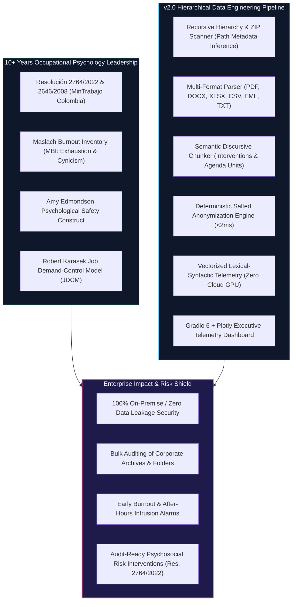
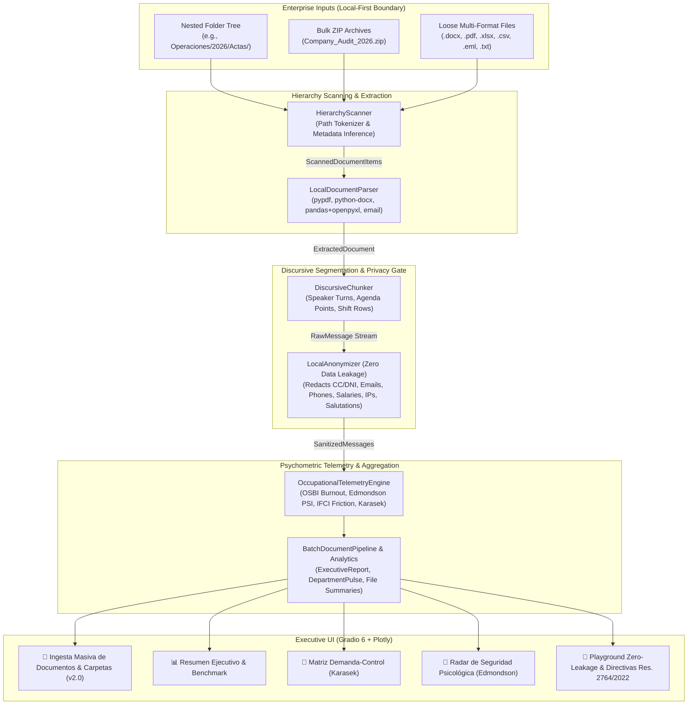

# 🏢 Workplace-Pulse-Telemetry v2.0: Local-First Hierarchical Document Ingestion & Occupational Telemetry Platform

[](https://github.com/neurodeveloper11/workplace-pulse-telemetry/actions)
[](https://huggingface.co/spaces/neurodeveloper/workplace-pulse-telemetry)
[](https://python.org)
[](https://pydantic.dev)
[](https://github.com/neurodeveloper11/workplace-pulse-telemetry)
[](https://www.docker.com)
[](https://www.mintrabajo.gov.co)
[](LICENSE)

An enterprise-grade, **Zero Data Leakage** occupational telemetry and behavioral NLP engine engineered to audit organizational climate, detect early signs of **burnout & verbal fatigue**, quantify **psychological safety**, and map teams into the **Karasek Demand-Control Matrix** directly on-premise without ever sending sensitive employee communications or corporate archives to external cloud APIs.

Designed and engineered by **[Fabio Torres](https://github.com/neurodeveloper11)** (Lead Psychologist & Data Engineer • 10+ Years Directing Psychosocial Risk Batteries for 1,500+ Port Terminal Workers in Colombia • M.Sc. in Data Engineering & Cloud Infrastructure).

---

## 🧠 The Domain Moat: «Del Diván al Dato» (Bridging Clinical Rigor with High-Throughput Engineering)

In real-world enterprises (ports, hospitals, banks, engineering firms), workplace climate and psychosocial risk signals are not confined to Slack or Teams chats. Critical organizational evidence is scattered across **hundreds of multi-format documents**:
- **COPASST and Workplace Harassment Committee Minutes (Actas de Convivencia):** Multi-page `.docx` and `.pdf` files.
- **Incident Reports, Disciplinary Hearings & Employee Complaints:** Scanned or generated `.pdf` and `.txt` files.
- **Shift Logs, Overtime Registries & Duty Rosters:** Spreadsheets in `.xlsx` and `.csv` format.
- **Archived Managerial Communications & Urgent Escalations:** Email archives in `.eml` and `.msg` format.
- **Complex Nested Folder Hierarchies:** e.g., `Enterprise/Port_Operations/2026/Committee_Minutes/minute_march.docx`.

Companies **cannot upload these folders to public cloud LLMs** due to trade secrets and strict privacy laws (Habeas Data Colombian Law 1581 of 2012, GDPR, HIPAA). **Workplace-Pulse-Telemetry v2.0 executes 100% On-Premise / Local-First**, processing entire folder trees and ZIP archives with Zero Data Leakage.



---

## 🔄 End-to-End System Architecture (v2.0)



---

## 📂 Multi-Format Ingestion Capabilities

| Formato | Motor Local | Metadatos Extraídos | Tipo de Segmentación Discursiva |
|---|---|---|---|
| **Word (`.docx`)** | `python-docx` | Título, autor, fecha de creación, encabezados, tablas estructuradas. | Intervenciones por orador (`Presidente:`, `Carlos:`) y compromisos numerados. |
| **PDF (`.pdf`)** | `pypdf` | Metadatos PDF, páginas, tablas de texto. | Paginación, secciones de hechos y descargos. |
| **Excel (`.xlsx`)** | `pandas` + `openpyxl` | Múltiples hojas, nombres de columnas, fechas y autores de fila. | Filas narrativas con justificaciones de horas extra y bitácoras de incidentes. |
| **CSV (`.csv`)** | `pandas` con autoseparador | Codificación robusta (`utf-8`, `latin1`, `cp1252`), filas de texto libre. | Un registro tabular por fila con contexto departamental. |
| **Emails (`.eml`)** | Python Standard `email` | `From`, `To`, `Date`, `Subject`, cuerpo `text/plain`. | Encabezado de auditoría + cuerpo segmentado por párrafos. |
| **Texto (`.txt`)** | I/O Nativo | Párrafos y memos descriptivos. | Ventanas deslizantes controladas (150-250 palabras) con solapamiento. |

---

## 📊 Scientific Formulation of Telemetric Indices

### 1. Occupational Stress & Burnout Index ($OSBI \in [0, 100]$)
Derived from the **Maslach Burnout Inventory (MBI)** dimensions and Colombian **Resolución 2764/2022** (Demandas cuantitativas y de la jornada):
- **Emotional Exhaustion ($E_{\text{exh}}$):** Lexical markers indicating cognitive depletion and collapse (*"agotado"*, *"no doy más"*, *"al límite"*, *"drained"*, *"burned out"*).
- **Urgency Pacing ($U_{\text{urg}}$):** Panic pacing tokens (*"URGENTE"*, *"para ayer"*, *"apaga incendios"*), ALL-CAPS words, and exclamation density.
- **After-Hours Traffic ($T_{\text{time}}$):** Penalizes communications sent outside standard hours ($< 07:00$ or $\ge 19:00$) and weekend traffic.
- **Cynicism & Depersonalization ($C_{\text{cyn}}$):** Apathy markers (*"da igual"*, *"no me pagan lo suficiente"*, *"not my problem"*).

$$\text{OSBI} = \min\left(100, \, \text{Base} + 28 E_{\text{exh}} + 18 U_{\text{urg}} + 22 C_{\text{cyn}} + 18 T_{\text{time}} + \text{CapsPenalty} - 8 P_{\text{prosocial}}\right)$$

### 2. Amy Edmondson Psychological Safety Index ($PSI \in [0, 100]$)
Modeled on the Harvard Business School 7-factor construct:
- **Vulnerability & Error Admission ($V$):** Transparently admitting faults without punitive fear (*"cometí un error"*, *"me equivoqué"*, *"necesito ayuda"*).
- **Inquiry & Open Curiosity ($I$):** High question-to-command ratio (*"¿qué opinan?"*, *"¿cómo lo ven?"*).
- **Constructive Disagreement ($C$):** Respectful challenge to the status quo (*"propongo una alternativa"*, *"otra perspectiva"*).
- **Penalizers:** Punitive commands and passive aggression (*"como ya te había dicho"*, *"tienes que hacer"*).

$$\text{PSI} = \min\left(100, \, \max\left(0, \, 55 + 22 V + 16 I + 14 C + 10 P_{\text{prosocial}} - 25 F_{\text{friction}} - 15 K_{\text{command}}\right)\right)$$

### 3. Robert Karasek Job Demand-Control Model ($JDCM$)
Categorizes teams into 4 operational quadrants:
- **Alta Tensión (High Strain):** $\text{Demand} \ge 45 \land \text{Autonomy} < 50 \rightarrow$ **Maximum Risk of Cardiovascular & Psychosomatic Collapse**.
- **Activo (Active):** $\text{Demand} \ge 45 \land \text{Autonomy} \ge 50 \rightarrow$ **Optimal Learning, High Motivation, High Performance**.
- **Pasivo (Passive):** $\text{Demand} < 45 \land \text{Autonomy} < 50 \rightarrow$ **Atrophy & Workplace Disengagement (Boreout)**.
- **Baja Tensión (Low Strain):** $\text{Demand} < 45 \land \text{Autonomy} \ge 50 \rightarrow$ **Stable, Low-Stress Comfort Zone**.

---

## 🧪 Rigorous Automated Testing Suite (35 Tests, 100% Pass)

```bash
$ python -m pytest
============================= test session starts =============================
platform win32 -- Python 3.13.14, pytest-9.1.1, pluggy-1.6.0
rootdir: D:\hoja_vida\projects_github\workplace-pulse-telemetry
plugins: anyio-4.15.1, dash-4.2.0
collected 35 items

tests/test_analytics.py ....                                             [ 11%]
tests/test_anonymizer.py ........                                        [ 34%]
tests/test_batch_pipeline.py ..                                          [ 40%]
tests/test_chunker.py ....                                               [ 51%]
tests/test_document_parser.py .....                                      [ 65%]
tests/test_hierarchy_scanner.py ....                                     [ 77%]
tests/test_schemas.py ...                                                [ 85%]
tests/test_synthetic_generator.py .                                      [ 88%]
tests/test_telemetry.py ....                                             [100%]

============================= 35 passed in 0.76s ==============================
```

---

## 🗂️ Repository Structure (v2.0)

```text
workplace-pulse-telemetry/
├── .github/
│   └── workflows/
│       └── ci.yml                     # GitHub Actions CI matrix (Py 3.10-3.13)
├── data/
│   ├── synthetic_workplace_logs.json # 100 benchmark events
│   ├── create_sample_corpus.py        # Generates realistic mock files (DOCX, PDF, XLSX, EML, TXT)
│   └── sample_documents/              # Enterprise directory hierarchy and demo ZIP bundle
│       ├── Operaciones_Portuarias/2026/Actas_Comite/acta_convivencia_marzo_2026.docx
│       ├── Finanzas_Contabilidad/2026/Auditorias/informe_auditoria_financiera_2026.pdf
│       ├── Ingenieria_Core/2026/Bitacoras/bitacora_guardias_incidentes.xlsx
│       ├── Comite_Convivencia_SST/2026/Emails/alerta_friccion_turno_nocturno.eml
│       ├── Atencion_Cliente/2026/Quejas/descargo_solicitud_apoyo.txt
│       └── auditoria_organizacional_2026_demo.zip
├── src/
│   ├── __init__.py
│   ├── schemas.py                     # Pydantic v2 data models & validation
│   ├── hierarchy_scanner.py           # Recursive folder & ZIP scanner + metadata inference
│   ├── document_parser.py             # Multi-format parser (PDF, DOCX, XLSX, CSV, EML, TXT)
│   ├── chunker.py                     # Semantic & discursive segmentation engine
│   ├── batch_pipeline.py              # Batch ingestion & end-to-end orchestrator
│   ├── anonymizer.py                  # Zero-leakage local PII redaction engine
│   ├── telemetry_engine.py            # Psychometric NLP engine (Maslach, Edmondson, Karasek)
│   ├── synthetic_generator.py         # Multi-department synthetic log generator
│   └── analytics.py                   # Organizational aggregator & HR directives
├── tests/
│   ├── __init__.py
│   ├── test_schemas.py
│   ├── test_hierarchy_scanner.py      # Path parsing, zip extraction, security checks
│   ├── test_document_parser.py        # PDF, Word, Excel, CSV, Email extraction tests
│   ├── test_chunker.py                # Discursive turn splitting & windowing tests
│   ├── test_batch_pipeline.py         # End-to-end batch integration tests
│   ├── test_anonymizer.py             # SHA-256 salted pseudonymization & PII redaction tests
│   ├── test_telemetry.py              # Psychometric bounds and marker detection tests
│   ├── test_synthetic_generator.py
│   └── test_analytics.py              # Karasek quadrants and executive report tests
├── app.py                             # Interactive Gradio 6 + Plotly v2.0 Dashboard
├── Dockerfile                         # Optimized production container image
├── docker-compose.yml                 # Single-command local deployment
├── requirements.txt                   # Pinned dependencies (including python-docx, pypdf, openpyxl)
├── LICENSE                            # MIT License
└── README.md                          # Comprehensive architecture and operational documentation
```

---

## ⚖️ Colombian Legal Alignment (Resolución 2764 de 2022)

In Colombia, the **Ministerio del Trabajo** enforces the mandatory administration and intervention of psychosocial risk factors under **Resolución 2764 de 2022** and **Resolución 2646 de 2008**. `Workplace-Pulse-Telemetry` bridges these regulatory demands into automated, non-invasive continuous telemetry:
- **Intralabor Demands (Demandas Cuantitativas y de la Jornada):** Audited via after-hours traffic ratio and urgency pacing markers.
- **Job Control & Autonomy (Control sobre el Trabajo):** Quantified via decision latitude and absence of micromanagement commands.
- **Leadership & Social Relations (Liderazgo y Relaciones Sociales):** Quantified via Amy Edmondson's psychological safety and interpersonal friction indices.

---

## 👤 Author & Contact

**Fabio Torres**  
*Lead Psychologist & Data Engineer («Del Diván al Dato»)*  
- **GitHub:** [@neurodeveloper11](https://github.com/neurodeveloper11)  
- **Hugging Face:** [@neurodeveloper](https://huggingface.co/neurodeveloper)  
- **Specialty:** Behavioral Telemetry, AI Alignment, Occupational Psychometrics, Cloud Infrastructure  
