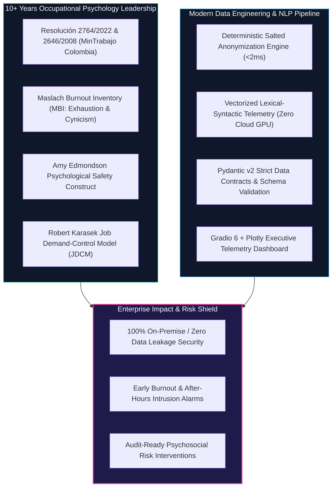
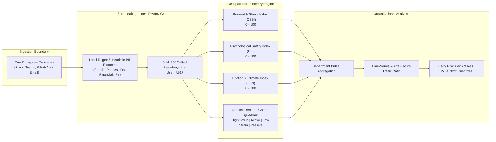

# 🏢 Workplace-Pulse-Telemetry: Local-First Occupational Telemetry & Burnout Detection Platform

[](https://github.com/neurodeveloper11/workplace-pulse-telemetry/actions)
[](https://huggingface.co/spaces/neurodeveloper/workplace-pulse-telemetry)
[](https://python.org)
[](https://pydantic.dev)
[](https://www.docker.com)
[](https://www.mintrabajo.gov.co)
[](LICENSE)

An enterprise-grade, **Zero Data Leakage** occupational telemetry and behavioral NLP engine engineered to audit organizational climate, detect early signs of **burnout & verbal fatigue**, quantify **psychological safety**, and map teams into the **Karasek Demand-Control Matrix** directly on-premise without ever sending sensitive employee communications to external cloud APIs.

Designed and engineered by **[Fabio Torres](https://github.com/neurodeveloper11)** (M.Sc. Candidate in Data Engineering & Cloud Infrastructure • 10+ Years Directing Psychosocial Risk Batteries for 1,500+ Port Terminal Workers in Colombia).

---

## 🧠 The Domain Moat: «Del Diván al Dato» (Bridging Clinical Rigor with High-Throughput Engineering)

Enterprise HR and leadership teams urgently need to detect workload collapse, toxic communication, and burnout before high-value talent resigns or suffers psychosomatic illness. However, **sending raw internal communications (Slack, Microsoft Teams, WhatsApp, emails) to public LLM APIs (OpenAI, Anthropic) introduces unacceptable legal and financial liabilities**:
- **Habeas Data & Privacy Regulations:** GDPR, HIPAA, and Colombian Statutory Law 1581 of 2012 prohibit transmitting unconsented employee PII.
- **Corporate Espionage & IP Leaks:** Financial transactions, client names, server IPs, and internal roadmaps would be exposed.
- **Superficial Sentiment Analysis:** Generic cloud sentiment APIs classify `"me equivoqué"` (admitting an error) as "negative sentiment", when in organizational psychology it is the ultimate hallmark of **high psychological safety** (Amy Edmondson).



---

## 🔄 End-to-End System Architecture



---

## 📊 Scientific Formulation of Telemetric Indices

### 1. Occupational Stress & Burnout Index ($OSBI \in [0, 100]$)
Derived from the **Maslach Burnout Inventory (MBI)** dimensions and Colombian **Resolución 2764/2022** (Demandas cuantitativas y de la jornada):
- **Emotional Exhaustion ($E_{\text{exh}}$):** Lexical markers indicating cognitive depletion and collapse (*"agotado"*, *"no doy más"*, *"al límite"*, *"drained"*, *"burned out"*).
- **Urgency Pacing ($U_{\text{urg}}$):** Panic pacing tokens (*"URGENTE"*, *"para ayer"*, *"apaga incendios"*), ALL-CAPS words, and exclamation density.
- **After-Hours Traffic ($T_{\text{time}}$):** Penalizes communications sent outside standard hours ($< 07:00$ or $\ge 19:00$) and weekend traffic.
- **Cynicism & Depersonalization ($C_{\text{cyn}}$):** Apathy markers (*"da igual"*, *"no me pagan lo suficiente"*, *"not my problem"*).

$$\text{OSBI} = \min\left(100, \, \text{Base} + 28 E_{\text{exh}} + 18 U_{\text{urg}} + 22 C_{\text{cyn}} + 18 T_{\text{time}} + \text{CapsPenalty} - 8 P_{\text{prosocial}}\right)$$

### 2. Amy Edmondson Psychological Safety Index ($PSI \in [0, 100]$)
Modeled on the Harvard Business School 7-factor construct:
- **Vulnerability & Error Admission ($V$):** Transparently admitting faults without punitive fear (*"cometí un error"*, *"me equivoqué"*, *"necesito ayuda"*).
- **Inquiry & Open Curiosity ($I$):** High question-to-command ratio (*"¿qué opinan?"*, *"¿cómo lo ven?"*).
- **Constructive Disagreement ($C$):** Respectful challenge to the status quo (*"propongo una alternativa"*, *"otra perspectiva"*).
- **Penalizers:** Punitive commands and passive aggression (*"como ya te había dicho"*, *"tienes que hacer"*).

$$\text{PSI} = \min\left(100, \, \max\left(0, \, 55 + 22 V + 16 I + 14 C + 10 P_{\text{prosocial}} - 25 F_{\text{friction}} - 15 K_{\text{command}}\right)\right)$$

### 3. Robert Karasek Job Demand-Control Model ($JDCM$)
Categorizes teams into 4 operational quadrants:
- **Alta Tensión (High Strain):** $\text{Demand} \ge 45 \land \text{Autonomy} < 50 \rightarrow$ **Maximum Risk of Cardiovascular & Psychosomatic Collapse**.
- **Activo (Active):** $\text{Demand} \ge 45 \land \text{Autonomy} \ge 50 \rightarrow$ **Optimal Learning, High Motivation, High Performance**.
- **Pasivo (Passive):** $\text{Demand} < 45 \land \text{Autonomy} < 50 \rightarrow$ **Atrophy & Workplace Disengagement (Boreout)**.
- **Baja Tensión (Low Strain):** $\text{Demand} < 45 \land \text{Autonomy} \ge 50 \rightarrow$ **Stable, Low-Stress Comfort Zone**.

---

## 🛡️ Benchmark Telemetry Across 4 Corporate Archetypes

| Department / Archetype | Messages | Burnout (OSBI) | Psych Safety (PSI) | Friction (IFCI) | After-Hours | Karasek Quadrant | Risk Level |
| :--- | :---: | :---: | :---: | :---: | :---: | :---: | :---: |
| **`Engineering-Core`** (Crunch / Outages) | 25 | **72.8** | 41.2 | 28.5 | **55%** | **High Strain** | 🚨 **CRITICAL** |
| **`Port-Logistics`** (Blame-Shifting / Friction) | 25 | 45.6 | 32.4 | **62.4** | 8% | **Passive / Strain** | 🚨 **CRITICAL** |
| **`AI-Research-Labs`** (High Psychological Safety) | 25 | **22.4** | **83.2** | **11.2** | 0% | **Active** | 🟢 **LOW** |
| **`Customer-Operations`** (Micromanagement / Apathy)| 25 | 48.0 | 38.0 | 42.0 | 4% | **Passive** | 🟡 **MODERATE** |

---

## 🚀 Quickstart & Local Installation

### Option 1: Run with Docker Compose (Recommended for On-Premise)

```bash
git clone https://github.com/neurodeveloper11/workplace-pulse-telemetry.git
cd workplace-pulse-telemetry
docker-compose up --build
```
Open your browser at `http://localhost:7860`.

### Option 2: Run with Python 3.10+ Virtual Environment

```bash
# 1. Clone repository
git clone https://github.com/neurodeveloper11/workplace-pulse-telemetry.git
cd workplace-pulse-telemetry

# 2. Create virtual environment
python -m venv venv
source venv/bin/activate  # On Windows: venv\Scripts\activate

# 3. Install dependencies
pip install -r requirements.txt

# 4. Run test suite
python -m pytest -v --tb=short

# 5. Launch dashboard
python app.py
```

---

## 🧪 Automated Testing Suite (Pytest)

The project includes **20 exhaustive unit tests** verifying schema strictness, zero-leakage PII elimination, mathematical boundary enforcement ($[0, 100]$), and regulatory heuristics:

```bash
python -m pytest -v --tb=short
```

Output:
```text
tests/test_analytics.py::test_karasek_quadrant_logic PASSED              [  5%]
tests/test_analytics.py::test_risk_level_evaluation PASSED               [ 10%]
tests/test_analytics.py::test_department_aggregation PASSED              [ 15%]
tests/test_analytics.py::test_executive_report_generation PASSED         [ 20%]
tests/test_anonymizer.py::test_email_redaction PASSED                    [ 25%]
tests/test_anonymizer.py::test_phone_redaction_colombia_and_international PASSED [ 30%]
tests/test_anonymizer.py::test_national_id_redaction PASSED              [ 35%]
tests/test_anonymizer.py::test_financial_and_salary_redaction PASSED     [ 40%]
tests/test_anonymizer.py::test_ip_address_redaction PASSED               [ 45%]
tests/test_anonymizer.py::test_greeting_names_and_mentions PASSED        [ 50%]
tests/test_anonymizer.py::test_pseudonym_consistency PASSED              [ 55%]
tests/test_anonymizer.py::test_full_message_anonymization PASSED         [ 60%]
tests/test_schemas.py::test_raw_message_valid PASSED                     [ 65%]
tests/test_schemas.py::test_message_telemetry_bounds_validation PASSED   [ 70%]
tests/test_schemas.py::test_department_pulse_creation PASSED             [ 75%]
tests/test_synthetic_generator.py::test_synthetic_generator_dataset_composition PASSED [ 80%]
tests/test_telemetry.py::test_burnout_and_urgency_detection PASSED       [ 85%]
tests/test_telemetry.py::test_amy_edmondson_psychological_safety PASSED  [ 90%]
tests/test_telemetry.py::test_interpersonal_friction_passive_aggression PASSED [ 95%]
tests/test_telemetry.py::test_telemetry_bounds_guarantee PASSED          [100%]

============================= 20 passed in 0.11s ==============================
```

---

## 🗂️ Repository Structure

```text
workplace-pulse-telemetry/
├── .github/
│   └── workflows/
│       └── ci.yml                 # GitHub Actions CI matrix (Py 3.10-3.13)
├── data/
│   └── synthetic_workplace_logs.json # 100 multi-archetype benchmark events
├── src/
│   ├── __init__.py
│   ├── schemas.py                 # Pydantic v2 data models & validation
│   ├── anonymizer.py              # Zero-leakage local PII redaction engine
│   ├── telemetry_engine.py        # Psychometric NLP engine (Maslach, Edmondson, Karasek)
│   ├── synthetic_generator.py     # Multi-department synthetic log generator
│   └── analytics.py               # Organizational aggregator & HR directives
├── tests/
│   ├── __init__.py
│   ├── test_schemas.py
│   ├── test_anonymizer.py
│   ├── test_telemetry.py
│   ├── test_synthetic_generator.py
│   └── test_analytics.py
├── app.py                         # Interactive Gradio 6 + Plotly dashboard
├── Dockerfile                     # Optimized container image
├── docker-compose.yml             # Single-command local deployment
├── requirements.txt               # Pinned dependencies
├── LICENSE                        # MIT License
└── README.md                      # Architecture, theory, and operational guide
```

---

## ⚖️ Colombian Legal Alignment (Resolución 2764 de 2022)

In Colombia, the **Ministerio del Trabajo** enforces the mandatory administration and intervention of psychosocial risk factors under **Resolución 2764 de 2022** and **Resolución 2646 de 2008**. `Workplace-Pulse-Telemetry` bridges these regulatory demands into automated, non-invasive continuous telemetry:
- **Intralabor Demands (Demandas Cuantitativas y de la Jornada):** Audited via after-hours traffic ratio and urgency pacing markers.
- **Job Control & Autonomy (Control sobre el Trabajo):** Quantified via decision latitude and absence of micromanagement commands.
- **Leadership & Social Relations (Liderazgo y Relaciones Sociales):** Quantified via Amy Edmondson's psychological safety and interpersonal friction indices.

---

## 👤 Author & Contact

**Fabio Torres**  
*Lead Psychologist & Data Engineer («Del Diván al Dato»)*  
- **GitHub:** [@neurodeveloper11](https://github.com/neurodeveloper11)  
- **Hugging Face:** [@neurodeveloper](https://huggingface.co/neurodeveloper)  
- **Specialty:** Behavioral Telemetry, AI Alignment, Occupational Psychometrics, Cloud Infrastructure  
